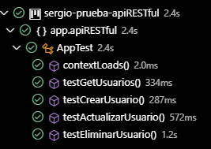
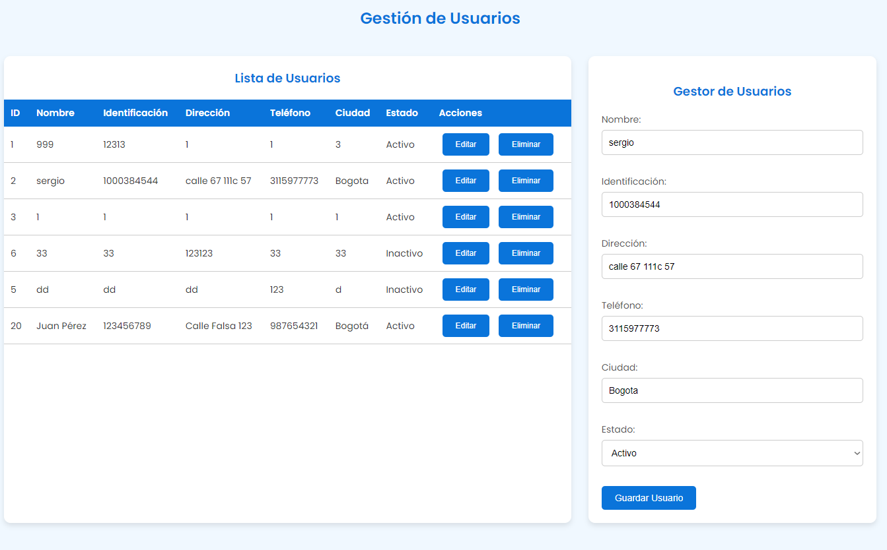
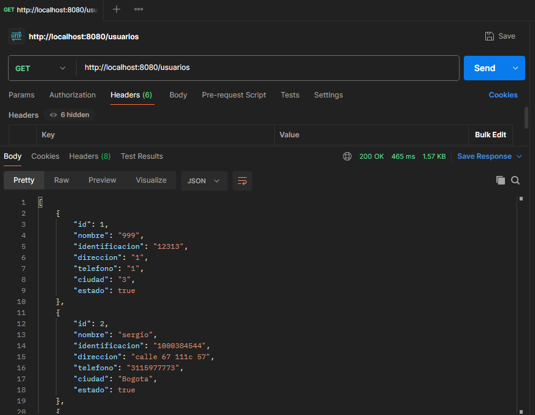
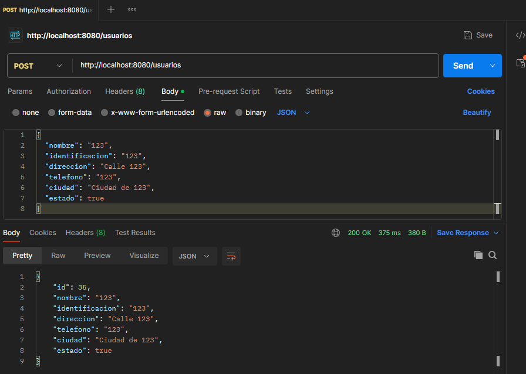

# Spring Boot API - Gestión de Usuarios
#### SERGIO DANIEL LOPEZ VARGAS
___

Este proyecto es una API RESTful desarrollada con Spring Boot, que permite gestionar la información de usuarios. Se conecta a una base de datos Oracle para almacenar los datos, utilizando JPA para la persistencia de la información.

## Requisitos

Asegúrate de tener las siguientes herramientas instaladas en tu sistema:

- [Java Development Kit (JDK)](https://www.oracle.com/java/technologies/javase-downloads.html) - Necesario para compilar y ejecutar el proyecto.
- [Maven](https://maven.apache.org/install.html) - Para compilar y ejecutar el proyecto Java.

## Descripción

La API proporciona las siguientes operaciones CRUD para gestionar los usuarios en la tabla creada por mi `SergioLopezTable`:

- **Listar usuarios**: Obtiene todos los usuarios almacenados en la base de datos.
- **Crear usuario**: Permite agregar un nuevo usuario.
- **Actualizar usuario**: Permite actualizar los datos de un usuario existente.
- **Eliminar usuario**: Permite eliminar un usuario por su ID.

## Tecnologías Utilizadas

- **Maven**: Herramienta para la gestión del proyecto.
- **Spring Boot**: Framework para desarrollar aplicaciones Java.
- **Spring Data JPA**: Framework para trabajar con bases de datos relacionales.
- **Oracle Database**: Base de datos utilizada para almacenar los usuarios.
- **Hibernate**: Proveedor JPA utilizado para la persistencia de datos.

## Configuración

1. Clona este repositorio en tu máquina local:

    ```bash
    git clone hhttps://github.com/sergiolopezzl/sergio-prueba-apiRESTful.git
    ```

2. Navegue al directorio del proyecto: 

    ```bash
    cd sergio-prueba-apiRESTful
    ```

3. Configura tu archivo `application.properties` **EN ESTE CASO SON LOS DE LA PRUEBA** Asegúrate de tener Oracle JDBC Driver en tu `classpath`:

    ```properties
    spring.datasource.url=jdbc:oracle:thin:@//158.101.126.83:1521/pdbprod.sub08291947280.vcnsanfordtest.oraclevcn.com
    spring.datasource.username=SKYNET
    spring.datasource.password=SkyNet2023$$
    spring.datasource.driver-class-name=oracle.jdbc.OracleDriver
    spring.jpa.database-platform=org.hibernate.dialect.Oracle12cDialect
    ```
    

4. Compila el y corre los Test del proyecto(no es necesario gracias a SpringBoot, pero es recomendable):

    ```bash
    mvn clean install
    ```

5. Ejecuta la aplicación desde un `IDLE` o con el siguiente comando:

    ```bash
    mvn spring-boot:run
    ```

6. La API estará disponible en `http://localhost:8080`.

7. Puedes utilizar **Postman** para realizar las pruebas, o bien acceder al archivo `index.html` que se encuentra en la raíz del proyecto. Este archivo está diseñado para ofrecer una mejor visualización y facilitar la interacción con las funcionalidades disponibles.

## Endpoints

- **GET /usuarios**: Obtiene todos los usuarios.
- **POST /usuarios**: Crea un nuevo usuario. El cuerpo de la solicitud debe contener un objeto JSON con los datos del usuario.
  
  Ejemplo de cuerpo de solicitud:
  
  ```json
  {
    "nombre": "Sergio Lopez",
    "identificacion": "1000384544",
    "direccion": "Calle 67 111c 57",
    "telefono": "3115977773",
    "ciudad": "Bogota",
    "estado": true
  }
  ```

- **PUT /usuarios/{id}**: Actualiza un usuario existente por su ID. El cuerpo de la solicitud debe contener los nuevos datos del usuario.
  
- **DELETE /usuarios/{id}**: Elimina un usuario por su ID.

## Estructura del Proyecto

- **`App.java`**: Clase principal para ejecutar la aplicación Spring Boot.
- **`model/Usuario.java`**: Entidad que representa un usuario en la base de datos.
- **`repository/UsuarioRepository.java`**: Repositorio para acceder a los datos de los usuarios.
- **`service/UsuarioService.java`**: Servicio que contiene la lógica de negocio para manejar los usuarios.
- **`controller/UsuarioController.java`**: Controlador que expone los endpoints de la API.
- **`AppTest.java`**: Clase Test principal para probar la aplicación Spring Boot.
    

## Imagen prueba coon el `Index` creado


## Pruebas con `Postman`



